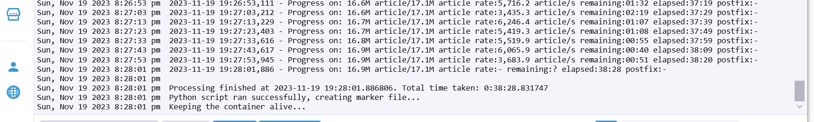

# TSM-AdvDaBa_TP22
TSM-AdvDaBa - Large database experiment with Neo4j

## Status
- Temps d'éxécution 38 minutes / 2GB RAM / 2-3 CPU / Batch_size_articles = 1000 / neo4j_batch_size = 100


## TODO
- ~~ajouter un message de début/fin de script qui s'affiche dans le terminal avec le temps total~~
- ~~faire le nécessaire pour que le gros json ne soit pas en local~~
- ~~vérifier que le nom des articles est bien lié à son _id~~
- ~~enlever neo4j du container pour kubernetes~~
- ~~Déploiement sur kubernetes fonctionnel~~
- Tester temps d'exécution script sur kubernetes

## Commentaires
- Seulement les articles qui ont un article_id, article_title et author (dict avec _id et name) sont ajoutés à neo4j
- Seulement les articles qui ont un article_id, article_title et references (liste d'articles) sont ajoutés à neo4j

## Docker (debug)
Push l'image sur docker hub
```
docker build --no-cache -t comfy2665/neo4j_large .
```
```
docker push comfy2665/neo4j_large
```
Stop the docker image  
```
docker compose down
```
Remove all unused containers, networks, and images  
    ⚠️ WARNING! This will remove all images without at least one container associated to them.  
```
docker system prune -a
```

## Kubernetes
### Check list
- [x] Créer un namespace
- [x] Push l'image sur docker hub
### Config
- Activer kubernetes dans Docker Desktop → Settings → Kubernetes → Enable Kubernetes
- Se logger sur le cluster et télécharger le fichier KubeConfig (en haut à droite de la page du cluster)
- Créer la variable d'environnement KUBECONFIG avec le path vers le fichier KubeConfig
    - Pour PowerShell:
        ```
        $env:KUBECONFIG="C:\path\to\local.yaml
        ```
    - Pour CMD:
        ```
        set KUBECONFIG=C:\path\to\local.yaml
        ```
    - Pour Linux:
        ```
        export KUBECONFIG=/path/to/local.yaml
        ```
- Créer un namespace
    - local (en dessous de la maison à gauche) → Projects/Namespaces → Create Namespace
- Test config
    ```
    kubectl describe ns adv-da-ba23-iglwae
    ```
### JSON
- Créer un persistent volume claim (pvc) → Storage → Persistent Volume Claims → Create Persistent Volume Claim
    - Fichier YAML dans le dossier kubernetes `json-data.yaml`
- Créer un pod temporaire pour envoyer le fichier dessus
    - Fichier YAML dans le dossier kubernetes `temp-pod.yaml`
    - `kubectl apply -f temp-pod.yaml`
- Copier le fichier JSON
    `cd "C:\Users\denis.iglesias\OneDrive - HESSO\03 Master\01 Cours\12 TSM-AdvDaBa\02 Labo\03 Labo 2.2 neo4j large database"`
    `kubectl cp dblpv13.json adv-da-ba23-iglwae/temp-pod:/mnt/dblpv13.json`
- Vérifier le fichier
    - `kubectl exec -it -n adv-da-ba23-iglwae temp-pod -- ls -lh /mnt/dblpv13.json`	
- Effacer le pod temporaire
    - `kubectl delete pod -n adv-da-ba23-iglwae temp-pod`
### Deployments/services
Deployments → Workloads → Deployments → Create Deployment
Services → Service Discovery → Services → Create Service
- Neo4j
    - Créer un deployment pour neo4j
        - Fichier YAML dans le dossier kubernetes `neo4j-deployment.yaml`
    - Créer un service pour neo4j
        - Fichier YAML dans le dossier kubernetes `neo4j-service.yaml`
- Python
    - Créer un deployment pour python
        - Fichier YAML dans le dossier kubernetes `python-app-deployment.yaml`
### Monitoring
`kubectl top pod -n adv-da-ba23-iglwae`

## Ressources
https://neo4j.com/docs/operations-manual/current/docker/ref-settings/
https://stackoverflow.com/questions/76207890/neo4j-docker-compose-to-kubernetes