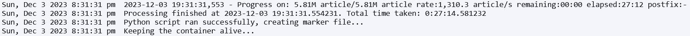
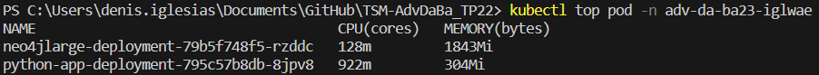

# TSM-AdvDaBa_TP22

TSM-AdvDaBa - Large database experiment with Neo4j

## Status
Temps de chargement: 27min

CPU 4 / RAM: max 2.2GB total (Python max 350MB)




## Résumé

### Texte explicatif

Nous avons utilisé Python comme langague. Pour le développement local nous avons utilisé 2 containers docker qui fonctionnent avec docker-compose.
Pour kubernetes nous avons utilisé 2 deployments et 2 services. Un pour neo4j et un pour python. Ceux-ci communiquent entre eux avec un service.
L'approche utilisée consiste à charger le fichier JSON ligne par ligne, corriger les lignes contenant des valeurs non conformes (NumberInt/NaN), puis parser le JSON en streaming à l'aide de la bibliothèque ijson. Ensuite, nous avons créé une liste de dictionnaires contenant les articles et leurs références, ainsi qu'une liste de dictionnaires contenant les articles et leurs auteurs. Enfin, nous avons créé les nœuds et les relations correspondants dans Neo4j.

### Utilisation

Les identifiants de neo4j sont neo4j/testtest

#### Local

Pour lancer l'application en local, il faut lancer le container docker-compose avec la commande suivante:
```
docker compose -f docker-compose-local.yml up
```

#### Kubernetes

Utiliser les fichiers yaml dans le dossier kubernetes pour créer les deployments et services. Il faut aussi créer un namespace au préalable.

#### Variables d'environnement
NEO4J_HOST → nom du service neo4j (localhost pour local ou nom du container pour docker-compose)
NEO4J_PORT → port du service neo4j (7687)
NEO4J_USER → nom d'utilisateur de neo4j (neo4j)
NEO4J_PASSWORD → mot de passe de neo4j (testtest)
NEO4J_URI → uri de neo4j (bolt://localhost:7687)
JSON_FILE → url du fichier json (http://vmrum.isc.heia-fr.ch/dblpv13.json)
BATCH_SIZE_ARTICLES → taille du batch d'articles juste après ijson (10000)
BATCH_SIZE_APOC → taille du batch pour apoc lors du chargement des données dans neo4j (5000)
BATCH_SIZE_NEO4J → avant de charger les données dans neo4j, on a équilibrer les différentes listes d'articles et d'auteurs pour avoir des batchs de taille équilibrée.
CHUNK_SIZE_HTTPX → taille du cache utilisé par httpx pour lire les lignes du fichier json
              value: "2560"
            - name: WORKER_COUNT_NEO4J
              value: "2"
          resources:
            limits:
              memory: "0.5Gi"
            requests:
              memory: "0.5Gi"

## Commentaires

- Seulement les articles qui ont un article_id, article_title et author (dict avec _id et name) sont ajoutés à neo4j
- Seulement les articles qui ont un article_id, article_title et references (liste d'articles) sont ajoutés à neo4j

## Docker

### Debug app avec neo4j en local (docker-compose)

Remove all unused containers, networks, and images  
    ⚠️ WARNING! This will remove all images without at least one container associated to them.  

```
docker system prune -a
```

Lancer le container avec neo4j and python

```
docker compose -f docker-compose-local.yml up
```

### Debug app avec neo4j en local (sans docker-compose)

Créer neo4j local avec apoc (ubuntu) pour tests

```
sudo docker run -p 7474:7474 -p 7687:7687 --name neo4j-apoc -e NEO4J_apoc_export_file_enabled=true -e NEO4J_apoc_import_file_enabled=true -e NEO4J_apoc_import_file_use__neo4j__config=true -e NEO4J_PLUGINS=\[\"apoc\"\] -e NEO4J_AUTH=neo4j/testtest neo4j:latest
```

### App python pour k8s

Remove all unused containers, networks, and images  
    ⚠️ WARNING! This will remove all images without at least one container associated to them.  

```
docker system prune -a
```

Build container

```
docker build --no-cache -t comfy2665/neo4j_large .
```

Push l'image sur docker hub

```
docker push comfy2665/neo4j_large
```

## Kubernetes

### Check list

- [x] Créer un namespace
- [x] Push l'image sur docker hub

### Config

- Activer kubernetes dans Docker Desktop → Settings → Kubernetes → Enable Kubernetes
- Se logger sur le cluster et télécharger le fichier KubeConfig (en haut à droite de la page du cluster)
- Créer la variable d'environnement KUBECONFIG avec le path vers le fichier KubeConfig
  - Pour PowerShell:

        ```
        $env:KUBECONFIG="C:\path\to\local.yaml
        ```
  - Pour CMD:

        ```
        set KUBECONFIG=C:\path\to\local.yaml
        ```
  - Pour Linux:

        ```
        export KUBECONFIG=/path/to/local.yaml
        ```

- Créer un namespace
  - local (en dessous de la maison à gauche) → Projects/Namespaces → Create Namespace
- Test config

    ```
    kubectl describe ns adv-da-ba23-iglwae
    ```

### JSON (pour information, pas nécessaire avec approche par url)

- Créer un persistent volume claim (pvc) → Storage → Persistent Volume Claims → Create Persistent Volume Claim
  - Fichier YAML dans le dossier kubernetes `json-data.yaml`
- Créer un pod temporaire pour envoyer le fichier dessus
  - Fichier YAML dans le dossier kubernetes `temp-pod.yaml`

    ```
    kubectl apply -f temp-pod.yaml
    ```

- Copier le fichier JSON

    ```
    cd "C:\Users\denis.iglesias\OneDrive - HESSO\03 Master\01 Cours\12 TSM-AdvDaBa\02 Labo\03 Labo 2.2 neo4j large database"
    kubectl cp dblpv13.json adv-da-ba23-iglwae/temp-pod:/mnt/dblpv13.json
    ```

- Vérifier le fichier

    ```
    kubectl exec -it -n adv-da-ba23-iglwae temp-pod -- ls -lh /mnt/dblpv13.json
    ```

- Effacer le pod temporaire

    ```
    kubectl delete pod -n adv-da-ba23-iglwae temp-pod
    ```

### Deployments/services

Deployments → Workloads → Deployments → Create Deployment
Services → Service Discovery → Services → Create Service

- Neo4j
  - Créer un deployment pour neo4j
    - Fichier YAML dans le dossier kubernetes `neo4j-deployment.yaml`
  - Créer un service pour neo4j
    - Fichier YAML dans le dossier kubernetes `neo4j-service.yaml`
- Python
  - Créer un deployment pour python
    - Fichier YAML dans le dossier kubernetes `python-app-deployment.yaml`

### Monitoring

```
kubectl top pod -n adv-da-ba23-iglwae
```

### Test de neo4j

```
kubectl port-forward -n adv-da-ba23-iglwae neo4jlarge-deployment-6444df6697-ckqw5 --address 0.0.0.0 7687:7687 7474:7474
```

```
MATCH (author:Author)-[:AUTHORED]->(article:Article {_id: '53e99b2cb7602d97023c84e9'}),
      (article)-[:REFERENCES]->(refArticle:Article)
RETURN author, article, refArticle
LIMIT 100
```

```
MATCH (article:Article)-[:REFERENCES]->(ref:Article)
RETURN COUNT(DISTINCT article)
```

```
MATCH (author:Author)-[:AUTHORED]->(a:Article)
RETURN author.name, author.`_id`, a.`_id`, a.title
LIMIT 10
```

## Ressources

<https://neo4j.com/docs/operations-manual/current/docker/ref-settings/>
<https://stackoverflow.com/questions/76207890/neo4j-docker-compose-to-kubernetes>
<https://neo4j.com/docs/getting-started/cypher-intro/schema/>
<https://neo4j.com/docs/cypher-manual/current/constraints/examples/>
